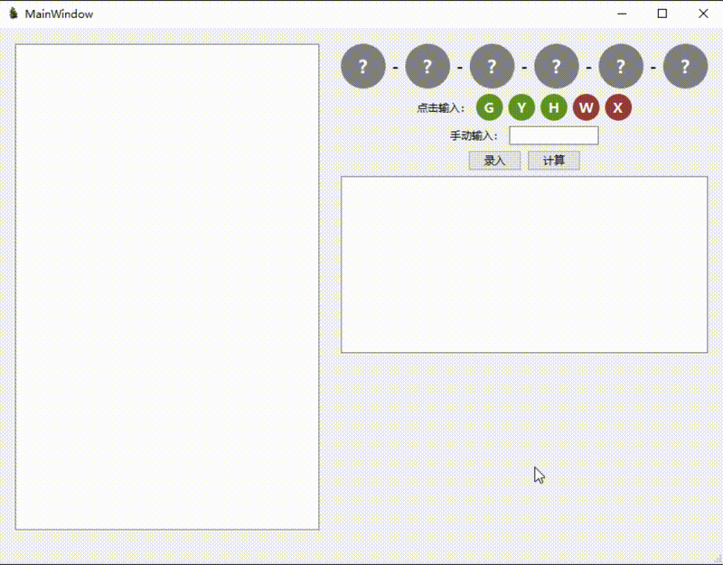

## Qt 基因种子组合计算器

本项目是一个使用 Qt 框架开发的桌面应用，用于录入、展示并计算基因种子的最佳组合方案。

### 功能演示

- 自定义种子条目展示（每个种子六个圆形基因位）
- 支持添加、删除种子
- 一键计算最佳组合并输出结果

### 项目结构简述

- `SeedModel`: 使用 `QAbstractListModel` 管理种子数据。
- `SeedDelegate`: 自定义 `QStyledItemDelegate` 渲染圆形基因位。
- `GeneListPanel`: 展示种子列表及计算功能。
- `GeneSettingsPanel`: 输入新种子。
- `GeneCalculator`: 核心计算逻辑。

### 编译说明

使用 Qt Creator 打开 `CMakeLists.txt` 文件并构建运行。

### TODO

- 自定义基因的权重
- 可以设置想要的基因，目前设置的是 3G3Y 为最好的基因
- 对种子每一位置上的基因进行生成时，给出更好的输出方案，而不是从权重和一样的基因中随机选一个
- 多线程进行优化计算过程，以及便计算边估值进行剪枝优化